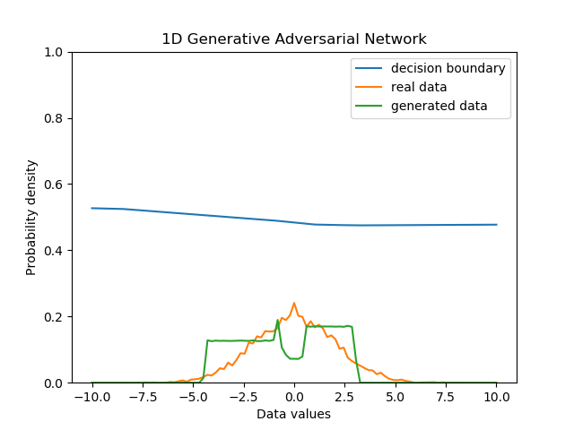
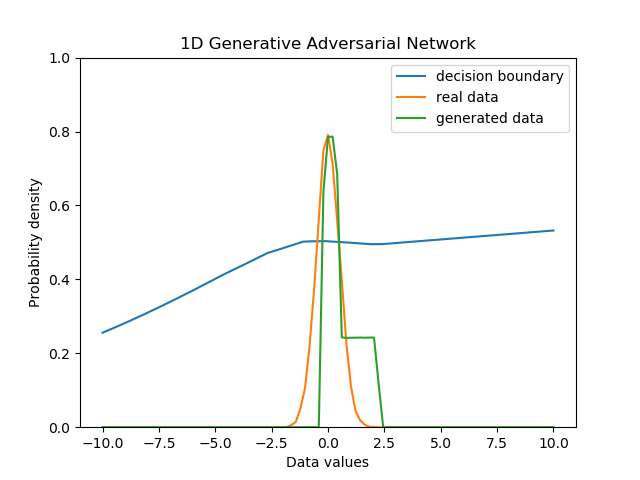

GAN Temporary document
======================

1d GAN
---------

# Result
## epoch timelapse

<table align='center'>
<tr align='center'>
 <td> Generate Distritubtion</td>
 </tr>
 <tr>
 <td> = Uniform(range = 8) </td>
 </tr>
<tr align='center'>
 <td> Data Distribution </td>
  </tr>
 <tr>
 <td> = N(-3,1) </td>
 </tr>
<tr>
 <td>
</tr>
</table>

## static result

<table align='center'>
<tr align='center'>
 <td> Generate Distritubtion</td>
 <td> Generate Distritubtion</td>
 <td> Generate Distritubtion</td>
 </tr>
 <tr>
 <td> = Uniform(range = 8) </td>
  <td> = Uniform(range = 8) </td>
  <td> = Uniform(range = 8) </td>
 </tr>
<tr align='center'>
 <td> Data Distribution </td>
  <td> Data Distribution </td>
  <td> Data Distribution </td>
  </tr>
 <tr>
 <td> = N(0,1) </td>
   <td> = N(0,2) </td>
   <td> = N(0,0.5) </td>
 </tr>
<tr>
 <td>
   <td>
     <td>
</tr>
</table>

### enviroment
1. epoch : 1000, batch size : 8, learning rate : 0.01

