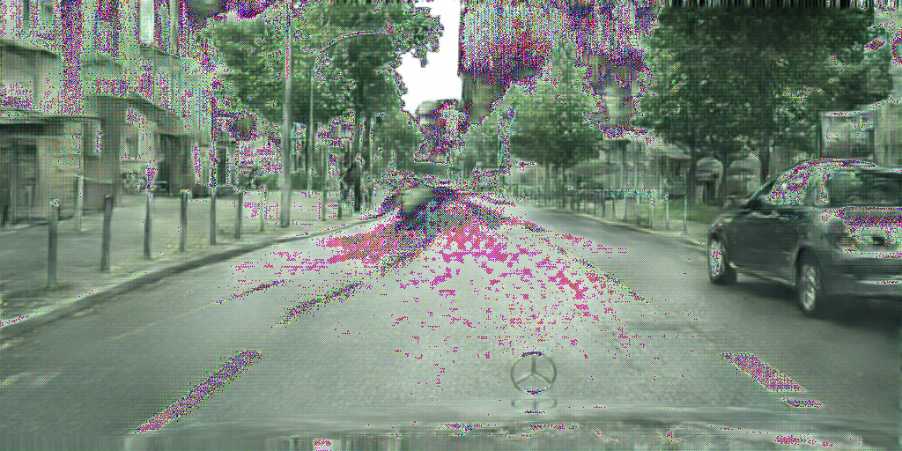
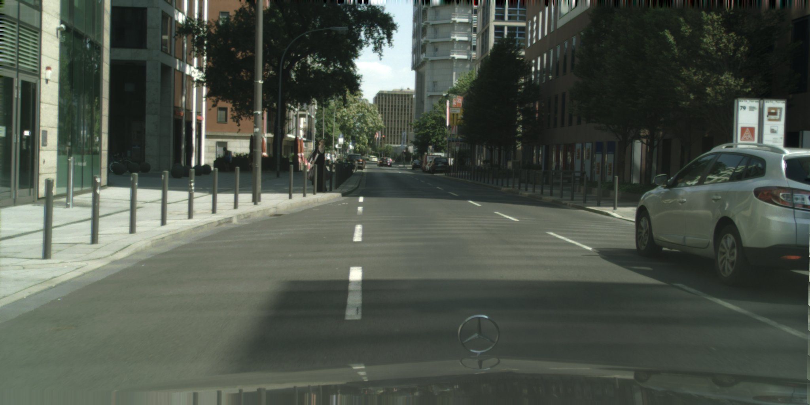
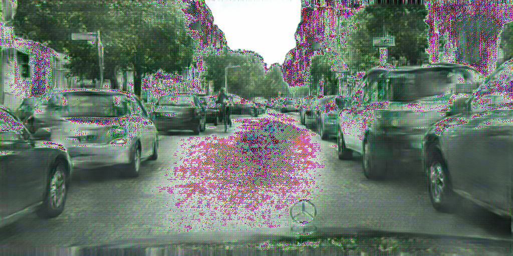
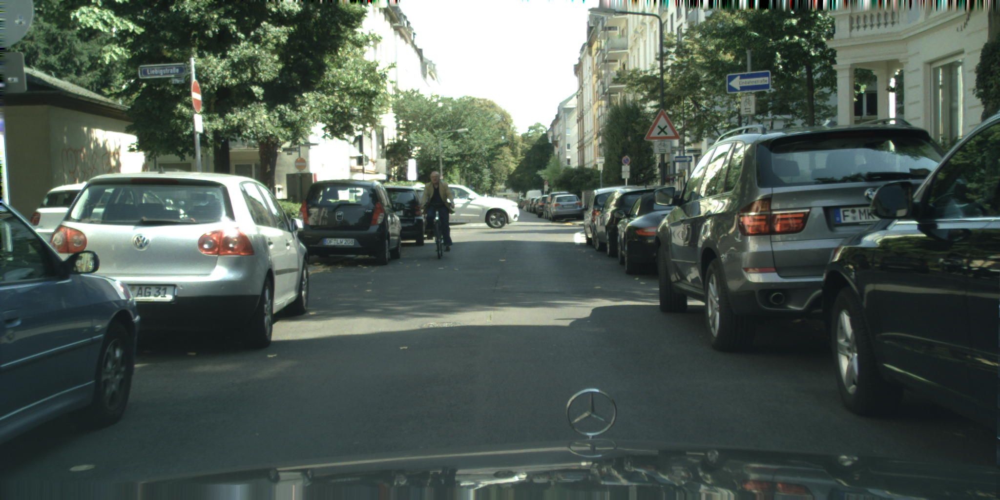
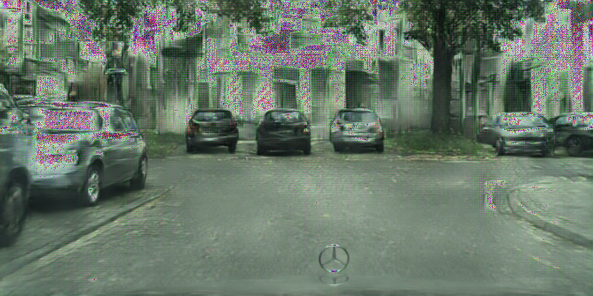

pix2pixHD temporary..
======================

midterm result 
---------

#### pytorch implementaion(epoch = 400, Not complete result)

<table align='center'>
<tr align='center'>
 <td> generated image</td>
 </tr>
<tr>
 <td></td>
</tr>
<tr align='center'>
 <td> ground truth</td>
 </tr>
<tr>
 <td></td>
</tr>
</table>

<table align='center'>
<tr align='center'>
 <td> generated image</td>
 </tr>
<tr>
 <td></td>
</tr>
<tr align='center'>
 <td> ground truth</td>
 </tr>
<tr>
 <td></td>
</tr>
</table>

<table align='center'>
<tr align='center'>
 <td> generated image</td>
 </tr>
<tr>
 <td></td>
</tr>
<tr align='center'>
 <td> ground truth</td>
 </tr>
<tr>
 <td></td>
</tr>
</table>

