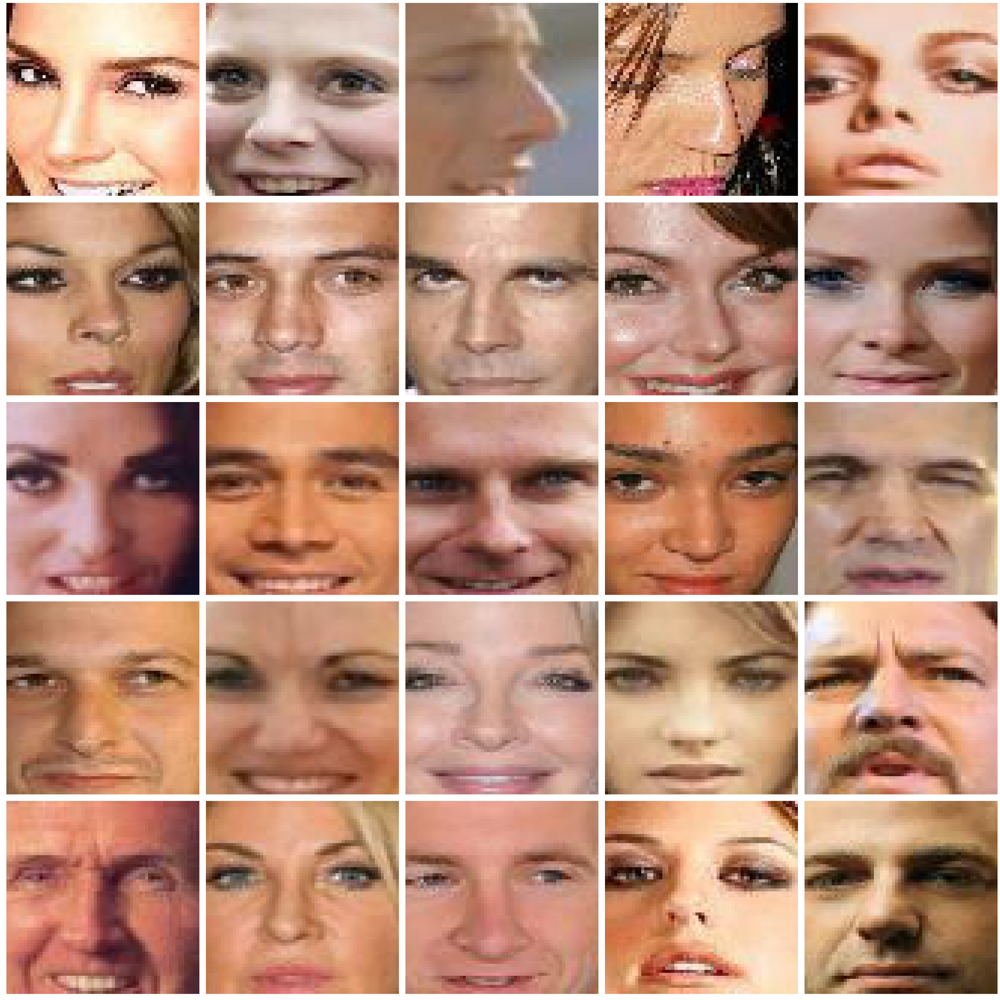
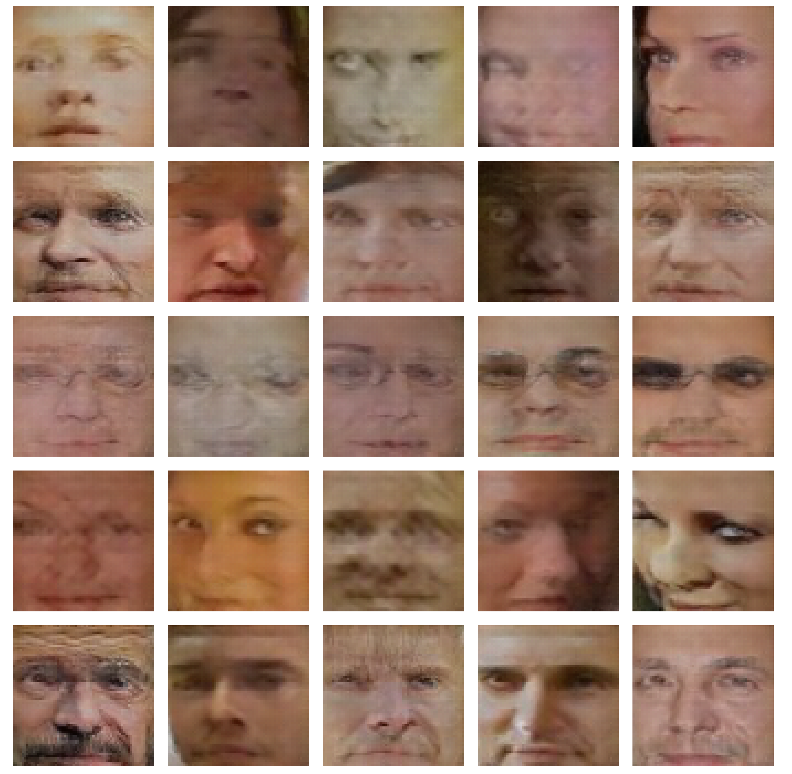

Inception score
======================

cDCGAN 
---------

#### Inception score

<table align='center'>
<tr align='center'>
 <td> Celeba Dataset</td>
 <td> cDCGAN</td>
 <td> ACGAN</td>
 </tr>
 <tr>
  <td> Inception score = 2.11  </td>
  <td> Inception score = 2.30</td>
  <td> Inception score = 2.29</td>
 </tr>
<tr>
 <td></td>
   <td> </td>
     <td> </td>
</tr>
</table>

#### pix2pix test compare

<table align='center'>
<tr align='center'>
 <td> cGan</td>
 </tr>
<tr>
 <td></td>
</tr>
</table>

<table align='center'>
<tr align='center'>
 <td> cGan with L1</td>
 </tr>
<tr>
 <td></td>
</tr>
</table>

<table align='center'>
<tr align='center'>
 <td> cGan with L1 and data flip and moving</td>
 </tr>
<tr>
 <td></td>
</tr>
</table>

