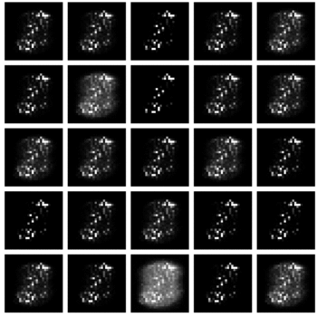
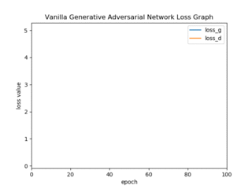
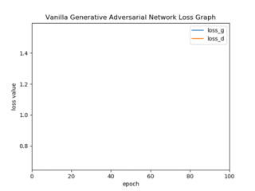
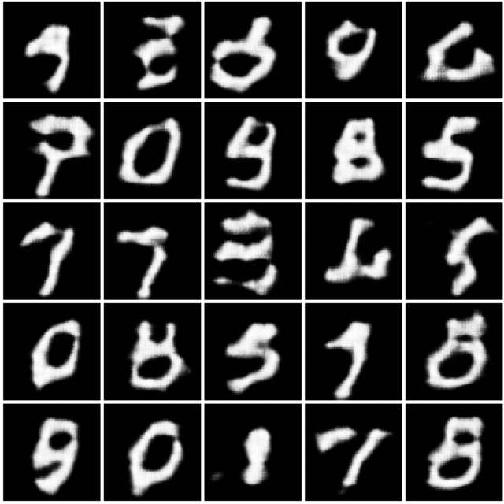
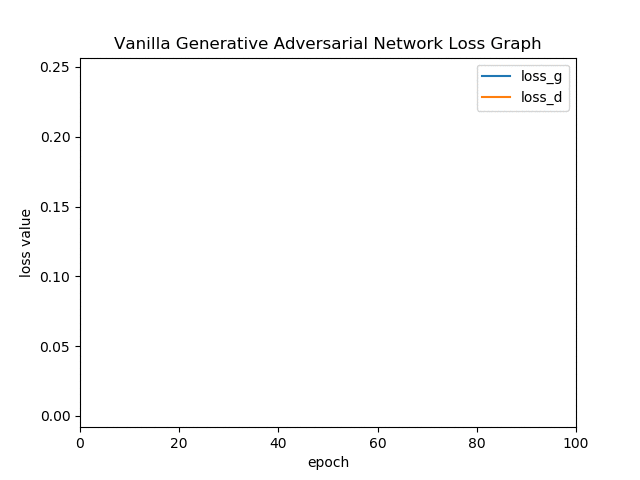

GAN Temporary document
======================

1d GAN
---------

# Result
## Epoch timelapse

<table align='center'>
<tr align='center'>
 <td> Z Distritubtion</td>
 </tr>
 <tr>
 <td> = Uniform(range = 8) </td>
 </tr>
<tr align='center'>
 <td> Data Distribution </td>
  </tr>
 <tr>
 <td> = N(-3,1) </td>
 </tr>
<tr>
 <td> </td>
</tr>
</table>

## Static result

<table align='center'>
<tr align='center'>
 <td> Z Distritubtion</td>
 <td> Z Distritubtion</td>
 <td> Z Distritubtion</td>
 </tr>
 <tr>
 <td> = Uniform(range = 8) </td>
  <td> = Uniform(range = 8) </td>
  <td> = Uniform(range = 8) </td>
 </tr>
<tr align='center'>
 <td> Data Distribution </td>
  <td> Data Distribution </td>
  <td> Data Distribution </td>
  </tr>
 <tr>
 <td> = N(0,1) </td>
   <td> = N(0,2) </td>
   <td> = N(0,0.5) </td>
 </tr>
<tr>
 <td></td>
   <td> </td>
     <td> </td>
</tr>
</table>

### Enviroment
1. epoch : 1000, batch size : 8, learning rate : 0.01

### Reference
1. https://github.com/hwalsuklee/tensorflow-GAN-1d-gaussian-ex
2. https://github.com/togheppi/vanilla_GAN
3. https://github.com/yunjey/pytorch-tutorial/tree/master/tutorials/01-basics/feedforward_neural_network

Vanilla Gan
------------------

# Mnist result
## Epoch timelapse

<table align='center'>
<tr align='center'>
 <td> Generated image</td>
 <td> Loss Graph </td>
 </tr>
<tr>
 <td> </td>
 <td></td>
</tr>
</table>

### Enviroment
1. epoch : 100, batch size : 25, learning rate : 0.0002 with dropout

#### extra result

<table align='center'>
<tr align='center'>
 <td> Generated image</td>
 <td> Loss Graph </td>
 </tr>
<tr>
 <td> </td>
 <td></td>
</tr>
</table>

###### Enviroment
1. epoch : 100, batch size : 25, learning rate : 0.0002 with batch normalization

### Reference
1. https://github.com/znxlwm/pytorch-MNIST-CelebA-GAN-DCGAN
2. https://github.com/togheppi/DCGAN
3. https://github.com/wiseodd/generative-models/tree/master/GAN/vanilla_gan

DCGAN
-----------------

# Mnist Result
## Epoch timelapse

<table align='center'>
<tr align='center'>
 <td> Generated image</td>
 <td> Loss Graph </td>
 </tr>
<tr>
 <td> </td>
 <td></td>
</tr>
</table>

### Enviroment
1. epoch : 8, batch size : 25, learning rate : 0.0002 ,activation fuction : ReLU For 
both (generator, discriminator) net , output activation fuction : Sigmoid

### Reference
1. https://github.com/znxlwm/pytorch-MNIST-CelebA-GAN-DCGAN

# celeba Result
## Epoch timelapse

<table align='center'>
<tr align='center'>
 <td> Generated image</td>
 <td> Loss Graph </td>
 </tr>
<tr>
 <td> </td>
 <td></td>
</tr>
</table> 

<table align='center'>
<tr align='center'>
 <td> Generated image(cropped)</td>
 <td> Loss Graph </td>
 </tr>
<tr>
 <td> </td>
 <td></td>
</tr>
</table> 

### Enviroment
1. epoch : 60, batch size : 25, learning rate : 0.0002 ,activation fuction : ReLU For 
both (generator, discriminator) net , output activation fuction : Sigmoid

